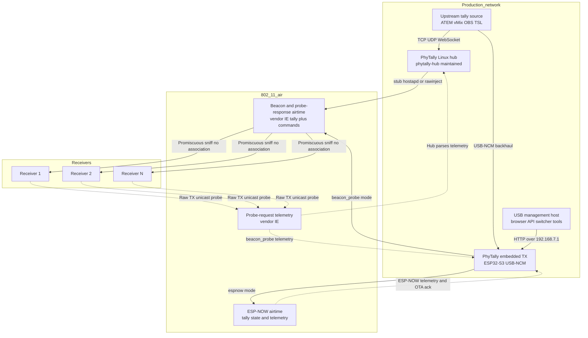
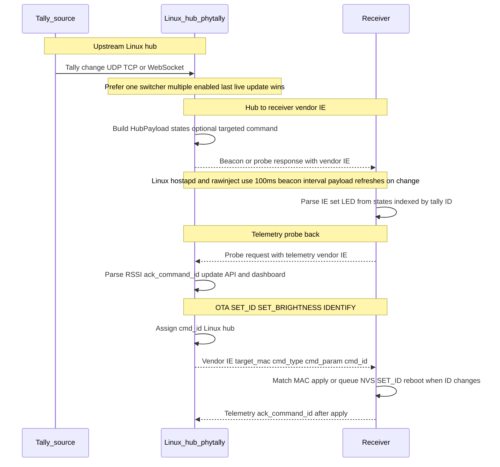

# PhyTally

A low-latency wireless tally light system using **802.11 Beacon Stuffing**. PhyTally allows multiple receivers to display tally states without ever associating with a Wi-Fi network, keeping interference low and updates fast.

## System Architecture



## Communication Flow



## Key Features

- **Multi-Protocol Support:** Native, direct integration with:
  - **Blackmagic Design ATEM** Switchers (Port 9910 UDP).
  - **vMix** (Port 8099 TCP with Overlay support).
  - **TSL 3.1** over UDP.
  - **OBS Studio** via **obs-websocket v5**.
- **No Wi-Fi Association Needed:** Receivers run in promiscuous (sniffer) mode for tally frames. They do not associate with the PhyTally Wi-Fi for tally data, avoiding IP management for the tally path.
- **Low Latency:** Linux `hostapd` and `rawinject` backends transmit management frames on a **100 ms** beacon interval; the hub **pushes a new vendor IE payload immediately** when tally state or an OTA command changes (plus a **1 s** housekeeping tick for simulation expiry and similar). The legacy ESP32 hub refreshes its vendor IE on beacon and probe response about **once per second** in the main loop.

---

## Hardware Requirements

### 1. PhyTally Hub (Maintained Path)
- **Device:** Linux host, VM, or Raspberry Pi with Ethernet plus a dedicated 2.4 GHz Wi-Fi NIC for PhyTally airtime.
- **Power / Network:** The host should have stable wired or management-plane connectivity to the same network as your ATEM, vMix, OBS, or TSL sender.

### 2. PhyTally Receiver
- **Device:** ESP32 Development Board, ESP32-S3 board with onboard NeoPixel, M5StickC, ESP32-C6 Super Mini, or ESP8266 Development Board.
- **Indicator:**
  - ESP32 RX: WS2812B / Neopixel LED on **GPIO 13**.
  - ESP32-S3 RX: onboard NeoPixel on **GPIO 48**.
  - ESP32-C6 RX: built-in RGB LED / NeoPixel, defaulting to **GPIO 8** on the common Super Mini layout.
  - ESP8266 RX: red tally LED on **GPIO 16**.
    Preview uses a short pulse pattern, Program is solid on, and offline/error uses a faster even blink.
- **Power:** USB Power Bank or LiPo battery.

---

## Project Status

The maintained primary transmitter path is the Linux hub in `phytally-hub/`.

An embedded alternative hub route also exists under `src/tx/` and `data/`.
The preferred embedded build is `tally_tx_esp32s3`, which uses USB-NCM for
its management plane and switcher backhaul while keeping the 2.4 GHz radio for
PhyTally airtime.
`tally_tx` remains available for the original ESP32 boards. Its notes now live
in `docs/esp32-alternative-hub.md`.

---

## Linux Hub

The maintained Linux/VM hub lives in `phytally-hub/`. It is designed for:

- Ethernet backhaul
- one dedicated 2.4 GHz radio used only for PhyTally beacon/probe traffic
- a Linux-hosted management plane with the existing dashboard/API contract

The current implementation can now run either:

- a `stub` radio backend for API/dashboard testing
- a `hostapd` backend that emits PhyTally vendor IEs from a dedicated Linux
  Wi-Fi NIC and captures receiver probe telemetry through a companion monitor
  interface
- a `rawinject` backend that temporarily switches the dedicated Wi-Fi NIC into
  monitor mode, injects both beacons and broadcast probe responses, can force
  a low transmit rate via radiotap, and exposes ath9k spectral scan support
  when the driver debugfs nodes are available

The Linux hub can ingest tally state directly from:

- **ATEM** at `atem_ip` over UDP `9910`
- **vMix** at `vmix_ip` over TCP `8099`
- **TSL 3.1** by listening on `tsl_listen_addr` over UDP, default `:9800`
- **OBS Studio** at `obs_url` over `obs-websocket` v5

If more than one switcher input is enabled, the last live update wins. In
normal operation you should enable only one upstream tally source.

The Linux binary embeds the dashboard assets, so `phytally-hub/` can be rsynced and
run on its own.

```bash
cd phytally-hub
GOCACHE=/tmp/phytally-go-build go test ./...
```

To run on a Linux VM with a dedicated USB Wi-Fi NIC:

```bash
cp phytally-hub.example.json phytally-hub.json
# edit radio_interface for the VM, then:
sudo ./phytally-hub-linux-arm64 -config ./phytally-hub.json
```

Suggested Wi-Fi hardware for the Linux / VM hub:

- Prefer **Atheros ath9k / ath9k_htc** devices when you want both monitor-mode TX
  (`rawinject`) and ath9k spectral support. The Linux hub looks for ath9k and
  ath9k_htc debugfs nodes when building `/api/v1/wifi/survey`.
- For the **best spectral scan support**, use a native or PCIe-passthrough
  ath9k card from the **AR92xx / AR93xx** families. Those chipsets expose the
  spectral scan feature documented by Linux Wireless, and they are the safest
  choice if spectrum data matters as much as tally airtime.
- For a **USB adapter passed through to a VM**, look for **AR9271**
  (`ath9k_htc`) hardware. Safe examples from the upstream ath9k_htc supported
  device list include:
  - **TP-Link TL-WN722N V1.x only**
  - **TP-Link TL-WN721N**
  - **Netgear WNA1100**
- Buy by **chipset / USB ID**, not by retail name alone. Several product lines
  changed chipsets across later revisions, so a used adapter that says
  `AR9271` / `0cf3:9271` is a better fit than a matching box label.
- Avoid vendor-driver Realtek adapters for the dedicated PhyTally radio. They
  are common, but they are a poor fit when you need reliable monitor mode,
  monitor-mode TX, and optional spectral survey data on Linux.

Switcher-related config fields:

```json
{
  "atem_ip": "192.168.1.50",
  "atem_enabled": false,
  "vmix_ip": "192.168.1.60",
  "vmix_enabled": false,
  "tsl_listen_addr": ":9800",
  "tsl_enabled": false,
  "obs_url": "ws://192.168.1.70:4455",
  "obs_password": "",
  "obs_enabled": false
}
```

For TSL 3.1, the Linux hub treats display address `0` as tally `1`, address `1`
as tally `2`, and so on up to `15 -> 16`. Control bit `0` maps to `PROGRAM`,
control bit `1` maps to `PREVIEW`.

OBS scene-to-tally mapping is intentionally simple:

- the OBS scene list order maps in reverse to tally IDs `1..16`
- the highest OBS `sceneIndex` becomes tally `1`
- scene names are ignored for tally numbering

Program scenes map to `PROGRAM`. In studio mode, the preview scene maps to
`PREVIEW` unless that tally is already `PROGRAM`.

To experiment with low-rate raw injection, set:

```json
{
  "radio_backend": "rawinject",
  "tx_rate_500kbps": 2
}
```

`tx_rate_500kbps: 2` means 1 Mbps.
In `rawinject` mode the dedicated `radio_interface` is repurposed into monitor
mode for the lifetime of the hub process, so it should not be shared with any
other network use.

When ath9k spectral debugfs is present, the Linux survey endpoint augments the
usual `iw` scan with per-channel spectral samples and includes the combined
result in `/api/v1/wifi/survey`.

For a persistent VM install, `phytally-hub/deploy/systemd/phytally-hub.service` and
`phytally-hub/scripts/install-systemd.sh` install the binary, config, and systemd
unit under `/usr/local/bin` and `/etc/phytally/`.

The migration plan is documented in `docs/phytally-hub.md`. The deferred ESP32 RF
range investigation is tracked in `docs/rf-range-plan.md`.
The shared receiver runtime is documented in `docs/rx-event-loop.md`.
Legacy ESP32 hub notes are in `docs/legacy-esp32-hub.md`.

---

## Managing Receivers

### Safe Bulk Deployment

To build and flash all currently connected supported receivers in one pass:

```bash
python3 scripts/deploy_receivers.py
```

---

## Embedded TX Debug Helpers

For the ESP32-S3 USB-NCM transmitter, use the local helper instead of repeating
raw serial, `ifconfig`, `ping`, and `curl` commands by hand:

```bash
python3 scripts/tx_debug.py ports
python3 scripts/tx_debug.py reset
python3 scripts/tx_debug.py monitor
python3 scripts/tx_debug.py smoke
python3 scripts/tx_debug.py retest
```

Notes:

- `reset` pulses the WCH UART/debug port to reboot the board.
- `reset` verifies reboot markers on the stable WCH UART/debug port, then waits
  for the USB-NCM interface to recover to `status: active` with the expected
  host IPv4 before reporting success.
- `reset` retries automatically when the ESP rebooted but the host-side NCM
  interface did not come back yet.
- `monitor` opens `pio device monitor` on the `usbmodem` console.
- `smoke` checks the USB-NCM interface, pings `192.168.7.1`, then requests `/`
  and `/api/v1/status` sequentially.
- `retest` combines `reset` plus `smoke`, which is the shortest path for USB-NCM
  regression testing.
- Override defaults with flags such as `--uart-port`, `--monitor-port`,
  `--interface`, `--interface-ip`, `--wait-seconds`,
  `--interface-wait-seconds`, `--host`,
  `--count`, and `--path`.

### Wireless Transport Modes

The embedded TX UI and API expose three wireless transport modes:

- `auto`: Prefer the configured route priority and switch to the other air path when telemetry on the active path goes stale.
- `beacon_probe`: Force classic PhyTally management-frame airtime only.
- `espnow`: Force ESP-NOW only.

Tradeoffs:

- `auto`: Best default for mixed testing and field recovery. Pros: keeps the system alive when one air path degrades and does not require manual intervention during brief RF issues. Cons: less deterministic during debugging because the active path can change under you.
- `beacon_probe`: Closest to the original PhyTally design. Pros: preserves compatibility with the existing beacon/probe receiver path and aligns naturally with Wi-Fi survey work because both features reason about normal 802.11 channels and management traffic. Cons: slower update cadence on the embedded TX than the maintained Linux hub, and more exposed to congestion from nearby 2.4 GHz Wi-Fi airtime.
- `espnow`: Best for dedicated ESP-NOW experiments. Pros: simpler data path, no reliance on beacon/probe airtime, and the right baseline for LR-oriented work. Cons: not the classic PhyTally wire format, less useful when validating beacon/probe behavior, and Wi-Fi survey results may not reflect ESP-NOW behavior directly.

Operational notes:

- Wi-Fi survey stays available regardless of selected transport, but a scan can temporarily disturb the active air path because the radio is shared.
- `auto` is the safest choice unless you are intentionally benchmarking or debugging one specific transport.
- If you are chasing RF behavior, force `beacon_probe` or `espnow` so the transport does not change mid-test.

### ESP-NOW PHY Modes

When the embedded TX is using `espnow`, the UI and API also expose an `espnow_phy_mode` setting:

- `lr_250k`: Espressif LR at 250 kbit/s. Pros: longest-range option in this firmware and the best tolerance for weak links. Cons: lowest throughput and highest airtime cost, so it is the easiest mode to saturate if you scale traffic up.
- `lr_500k`: Espressif LR at 500 kbit/s. Pros: still LR-capable, but faster than `lr_250k`; often a better practical starting point for long-range tests. Cons: less margin than `lr_250k` and still proprietary LR, so it is less representative of ordinary Wi-Fi behavior.
- `11b_1m`: legacy DSSS/DBPSK at 1 Mbit/s. Pros: very robust, broadly compatible, and the safest non-LR baseline. Cons: slower than the higher-rate classic modes.
- `11b_2m`: legacy DSSS/DQPSK at 2 Mbit/s. Pros: a useful middle ground if `11b_1m` is too slow but you want to stay in the 802.11b family. Cons: less link margin than `11b_1m`.
- `11b_11m`: legacy CCK at 11 Mbit/s. Pros: highest throughput within the 802.11b family. Cons: materially less robust than the slower `11b` rates.
- `11g_6m`: OFDM/BPSK at 6 Mbit/s. Pros: a good low-end OFDM mode when you want behavior closer to later Wi-Fi PHYs without jumping to much higher rates. Cons: usually less forgiving than `11b_1m` on fringe links.

Practical notes:

- Default is `11b_1m`.
- The TX setting controls the embedded hub's ESP-NOW transmit mode.
- The embedded TX can now OTA-push the selected ESP-NOW PHY to receivers before changing its own PHY, so route changes do not depend on manual receiver reflashing.
- Per-receiver current PHY is still easiest to verify from RX serial logs; it is not yet exposed as a first-class inventory field in the hub API.

Useful variants:

```bash
python3 scripts/deploy_receivers.py --list-only
python3 scripts/deploy_receivers.py --port /dev/cu.usbserial-0001
python3 scripts/deploy_receivers.py --env tally_rx_esp8266
python3 scripts/deploy_receivers.py --port-env /dev/cu.usbserial-0001=tally_rx_esp8266
```

The deploy script is intentionally conservative:

- it probes ports sequentially, never in parallel
- it uses bounded probe and upload timeouts so a wrong port cannot hang the whole run
- it deduplicates multi-port devices before probing
- it builds each PlatformIO environment once, then uploads sequentially
- it uses per-environment PlatformIO core directories under `/tmp` to avoid lockups and broken shared cache state
- it takes a global lock so two deploy runs cannot fight over the same serial devices

### REST API

**Linux hub (`phytally-hub`)** exposes JSON under `/api/v1`. The dashboard at `/` is **embedded** in the binary from `phytally-hub/internal/api/web/`.

- `GET /api/v1`: API discovery document.
- `GET /api/v1/status`: Hub status, radio state, telemetry summary, tally states, receivers.
- `GET /api/v1/config`: Saved radio and switcher configuration.
- `GET /api/v1/events`: **Server-Sent Events** stream for live UI updates.
- `POST /api/v1/wifi/survey`: Start asynchronous Wi-Fi survey (Linux hub).
- `GET /api/v1/wifi/survey`: Survey status and results.
- `PUT /api/v1/config`: Update configuration; Linux hub restarts radio as needed.
- `POST /api/v1/simulation`: Enable or disable simulation.
- `POST /api/v1/tallies/set`: Set one tally program on or off (manual override).
- `GET /api/v1/receivers`: List receivers.
- `POST /api/v1/receivers/assign-id`: Queue OTA `SET_ID` (target MAC + tally id).
- `POST /api/v1/receivers/set-brightness`: Queue OTA `SET_BRIGHTNESS`.
- `POST /api/v1/receivers/identify`: Queue OTA `IDENTIFY` animation.

Example requests (replace `HUB_HOST` with your hub IP or hostname, e.g. `192.168.1.10:8080` if you bind HTTP there):

```bash
curl "http://HUB_HOST/api/v1/status"
```

```bash
curl -X POST "http://HUB_HOST/api/v1/wifi/survey"
```

```bash
curl "http://HUB_HOST/api/v1/wifi/survey"
```

```bash
curl -X POST "http://HUB_HOST/api/v1/simulation" \
  -H 'Content-Type: application/json' \
  -d '{"enabled":true}'
```

```bash
curl -X POST "http://HUB_HOST/api/v1/tallies/set" \
  -H 'Content-Type: application/json' \
  -d '{"tally_id":2,"on":true}'
```

```bash
curl -X POST "http://HUB_HOST/api/v1/receivers/assign-id" \
  -H 'Content-Type: application/json' \
  -d '{"mac":"80:7D:3A:C4:40:60","tally_id":2}'
```

**Embedded TX (`src/tx/`)** exposes a subset of the Linux API plus embedded-only wireless controls:

- `GET /api/v1`
- `GET /api/v1/status`
- `GET /api/v1/config`
- `PUT /api/v1/config`
- `POST /api/v1/simulation`
- `GET /api/v1/wifi/survey`
- `POST /api/v1/wifi/survey`
- `POST /api/v1/receivers/assign-id`
- `POST /api/v1/receivers/set-brightness`
- `POST /api/v1/receivers/identify`
- `GET /api/v1/wireless/transport`
- `POST /api/v1/wireless/transport`
- `GET /api/v1/wireless/espnow/phy`
- `POST /api/v1/wireless/espnow/phy`

Current embedded-TX gaps relative to the Linux hub:

- no `GET /api/v1/events` SSE stream; the shared dashboard falls back to polling
- no `POST /api/v1/tallies/set`
- no per-receiver PHY inventory in the API yet

**Embedded dashboard (LittleFS)** for the ESP TX:

- `data/index.html`, `data/dashboard.css`, `data/dashboard.js`

After editing those files for the embedded TX:

```bash
python3 scripts/tx_flash.py uploadfs
```

---

## Tally States
| Color | Status | Meaning |
| :--- | :--- | :--- |
| **Red** | **Program** | Active / Live on Output. |
| **Green** | **Preview** | Selected in Preview window. |
| **Black** | **Off** | Not active. |
| **Flashing Yellow** | **Signal Lost** | Receiver cannot find the Hub for > 2 seconds. |

---

## Project Structure
- `phytally-hub/`: Maintained Linux hub (Go): REST API, embedded web UI, switcher clients, radio backends (`stub`, `hostapd`, `rawinject`).
- `src/tx/`: ESP32 / ESP32-S3 alternative hub firmware. Preferred build: `tally_tx_esp32s3`. See `docs/esp32-alternative-hub.md`.
- `src/rx/`: ESP32 receiver firmware (promiscuous RX, LED, serial config).
- `src/rx_esp32c6/`: ESP32-C6 receiver variant.
- `src/rx8266/`: ESP8266 receiver variant.
- `lib/ReceiverCommon/`: Shared receiver parsing, telemetry probe build, OTA command handling, signal-loss scan.
- `lib/TallyProtocol/`: Shared C++ protocol structs and constants (mirrored in Go `internal/protocol`).
- `data/`: Shared embedded dashboard assets served from LittleFS on the ESP TX builds.

## PlatformIO Targets
- `tally_tx`: ESP32 hub firmware.
- `tally_rx`: ESP32 receiver firmware.
- `tally_rx_esp32s3`: ESP32-S3 receiver firmware.
- `tally_rx_esp32c6`: ESP32-C6 receiver firmware.
- `tally_rx_esp8266`: ESP8266 receiver firmware.

## Board Adaptation Notes
If you are bringing the receiver firmware to a different board family, use [docs/board-porting.md](docs/board-porting.md). It covers the parts that normally change per board:
- LED driver and pin mapping.
- USB CDC vs UART serial console behavior.
- PlatformIO board/env selection.
- Low-bandwidth probe telemetry and Wi-Fi API assumptions.

## Protocol Technical Details

Receivers parse **802.11 management** frames whose subtype is **beacon (`0x80`)** or **probe response (`0x50`)**. They scan Information Elements for **vendor-specific tag 221 (`0xDD`)** whose body starts with:

| Field | Value |
| :--- | :--- |
| OUI | `11:22:33` |
| Next byte | `0x01` (protocol version; must match for acceptance) |

The packed **`HubPayload`** (vendor data after OUI + version byte in the IE body) is:

| Field | Size | Notes |
| :--- | :--- | :--- |
| `states[]` | 16 bytes | Index `0..15` = tally IDs **1..16**. Values: `0` off, `1` preview, `2` program, `3` error. |
| `target_mac` | 6 bytes | OTA command destination (zero when no command). |
| `cmd_type` | 1 byte | `0` none, `1` SET_ID, `2` REBOOT *(reserved; receivers do not handle)*, `3` SET_BRIGHTNESS, `4` IDENTIFY, `5` SET_ESPNOW_PHY. |
| `cmd_param` | 1 byte | New tally index for SET_ID (`0..15`), brightness byte for SET_BRIGHTNESS, unused for IDENTIFY, or ESP-NOW PHY enum value for SET_ESPNOW_PHY. |
| `cmd_id` | 1 byte | Non-zero command sequence for dedup and telemetry ack tracking. |

**Receiver → hub telemetry** uses a **probe request** (`0x40`) with another vendor IE:

| Field | Value |
| :--- | :--- |
| OUI | `11:22:44` |
| Body | **`TelemetryPayload`**: protocol `0x01`, `tally_id`, `battery_percent`, `rssi`, `status_flags`, `led_brightness`, `ack_command_id`. |

Firmware currently sends **`battery_percent = 100`** and **`status_flags = 0`** as placeholders. **`ack_command_id`** echoes the hub `cmd_id` after the receiver applies a command, including OTA ESP-NOW PHY changes.

Definitions: [`lib/TallyProtocol/TallyProtocol.h`](lib/TallyProtocol/TallyProtocol.h), Go mirror [`phytally-hub/internal/protocol/protocol.go`](phytally-hub/internal/protocol/protocol.go).
